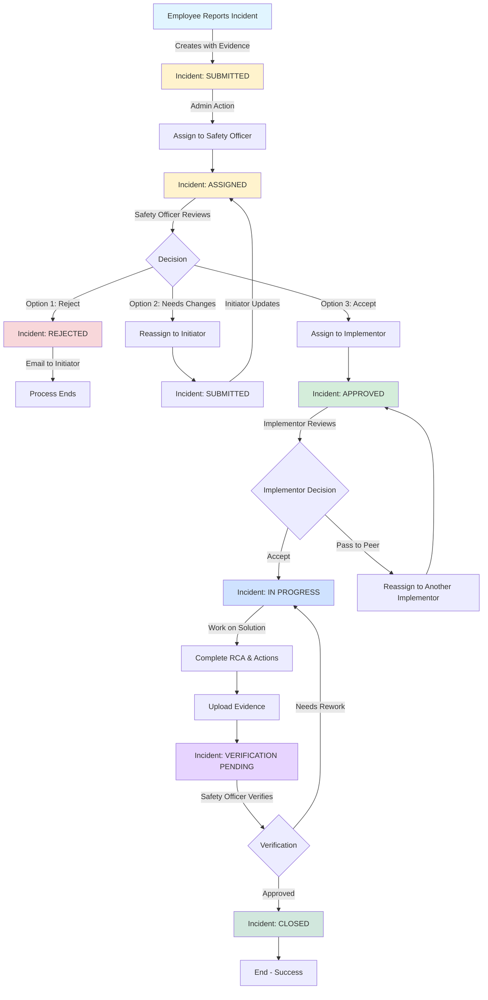

# EHS System - Detailed Workflow Diagrams

## 📊 Complete Incident Lifecycle



## 🔄 Status Transition Matrix

| Current Status | Possible Next Status | Triggered By | Action |
|---------------|---------------------|--------------|--------|
| **SUBMITTED** | ASSIGNED | Admin | Assign to Safety Officer |
| **SUBMITTED** | REJECTED | Safety Officer | Reject incident |
| **ASSIGNED** | REJECTED | Safety Officer | Reject incident |
| **ASSIGNED** | SUBMITTED | Safety Officer | Reassign to initiator |
| **ASSIGNED** | APPROVED | Safety Officer | Accept & assign to implementor |
| **APPROVED** | IN PROGRESS | Implementor | Accept incident |
| **APPROVED** | APPROVED | Implementor | Pass to peer |
| **IN PROGRESS** | VERIFICATION PENDING | Implementor | Complete implementation |
| **VERIFICATION PENDING** | CLOSED | Safety Officer | Verify & close |
| **VERIFICATION PENDING** | IN PROGRESS | Safety Officer | Request rework |

## 👥 Role-Based Actions

### Initiator Actions
```
┌─────────────────────────────────────────┐
│           INITIATOR ROLE                │
├─────────────────────────────────────────┤
│ ✓ Create new incident                  │
│ ✓ Upload evidence (photos, documents)  │
│ ✓ View own incidents                   │
│ ✓ Update incident (if SUBMITTED)       │
│ ✓ Delete incident (if SUBMITTED)       │
│ ✓ Receive email notifications          │
└─────────────────────────────────────────┘
```

### Safety Officer Actions
```
┌─────────────────────────────────────────┐
│        SAFETY OFFICER ROLE              │
├─────────────────────────────────────────┤
│ ✓ View pending reviews                 │
│ ✓ View pending verifications           │
│ ✓ Reject incident with comment         │
│ ✓ Reassign to initiator for changes    │
│ ✓ Accept & assign to implementor       │
│ ✓ Verify completed implementations     │
│ ✓ Close incidents                       │
│ ✓ Add closure comments                 │
└─────────────────────────────────────────┘
```

### Implementor Actions
```
┌─────────────────────────────────────────┐
│         IMPLEMENTOR ROLE                │
├─────────────────────────────────────────┤
│ ✓ View assigned incidents              │
│ ✓ Accept incident (set timeline)       │
│ ✓ Pass to peer implementor             │
│ ✓ Perform Root Cause Analysis (RCA)    │
│ ✓ Document corrective actions          │
│ ✓ Identify benefits                    │
│ ✓ Upload implementation evidence       │
│ ✓ Mark as complete                     │
└─────────────────────────────────────────┘
```

### Admin Actions
```
┌─────────────────────────────────────────┐
│            ADMIN ROLE                   │
├─────────────────────────────────────────┤
│ ✓ Assign incidents to safety officers  │
│ ✓ Full system access                   │
│ ✓ User management                      │
│ ✓ Master data management               │
└─────────────────────────────────────────┘
```

## 📧 Email Notification Flow

```
┌─────────────────────────────────────────────────────────┐
│                  EMAIL NOTIFICATIONS                    │
└─────────────────────────────────────────────────────────┘

Incident Created
    ↓
    Email to: Admin
    Template: IncidentCreated.cshtml
    
Assigned to Safety Officer
    ↓
    Email to: Safety Officer + Initiator
    Template: IncidentAssigned.cshtml
    
Incident Rejected
    ↓
    Email to: Initiator
    Template: IncidentRejected.cshtml
    
Reassigned to Initiator
    ↓
    Email to: Initiator
    Template: IncidentReassigned.cshtml
```

## 🔐 Authentication Flow

```
┌──────────────────────────────────────────────────────────┐
│         HYBRID AZURE AD AUTHENTICATION                   │
└──────────────────────────────────────────────────────────┘

User Login
    ↓
Azure AD Authentication
    ↓
Token Validation (JWT)
    ↓
UserSyncMiddleware
    ↓
Check Azure ObjectId in Local DB
    ↓
    ├─ User Exists → Get Local User ID
    │                     ↓
    │              Add "LocalUserId" Claim
    │                     ↓
    │              Add to User Principal
    │
    └─ User Not Exists → Create Local User
                              ↓
                       Sync from Azure AD
                              ↓
                       Add "LocalUserId" Claim
    ↓
Controller Access (uses LocalUserId)
```

## 📁 File Upload & Storage Flow

```
┌──────────────────────────────────────────────────────────┐
│              FILE STORAGE WORKFLOW                       │
└──────────────────────────────────────────────────────────┘

Client Uploads File
    ↓
POST /api/v1/storage/upload
    ↓
Validate File (type, size)
    ↓
Generate Unique Filename
    ↓
Upload to Azure Blob Storage
    ↓
Return File Metadata
    {
        "fileName": "unique-guid.jpg",
        "originalFileName": "evidence.jpg",
        "contentType": "image/jpeg",
        "fileSize": 1024000
    }
    ↓
Client Includes in Incident/Implementation Request
    ↓
Server Creates IncidentAttachment Record
    ↓
On Retrieval: Generate SAS URL (60 min validity)
```

## 🔍 Implementation Details Flow

```
┌──────────────────────────────────────────────────────────┐
│         IMPLEMENTATION COMPLETION WORKFLOW               │
└──────────────────────────────────────────────────────────┘

Implementor Accepts Incident
    ↓
    Estimated Days: 7
    Status: IN PROGRESS
    ↓
Implementor Works on Solution
    ↓
Completes Implementation Form:
    ├─ Root Cause Analysis
    │   ├─ Root Cause 1
    │   │   ├─ Corrective Measure
    │   │   ├─ Responsible Party
    │   │   └─ Target Completion Date
    │   └─ Root Cause 2...
    │
    ├─ Corrective Actions Description
    │
    ├─ Closure Action Type
    │   (e.g., Permanent Fix, Temporary Fix, etc.)
    │
    ├─ Benefits Identified
    │   ├─ Cost Savings
    │   ├─ Safety Improvement
    │   └─ Efficiency Gain
    │
    └─ Evidence Attachments
        ├─ Before Photos
        ├─ After Photos
        └─ Supporting Documents
    ↓
Submit Implementation
    ↓
Status: VERIFICATION PENDING
    ↓
Safety Officer Reviews
    ↓
    ├─ Approved → CLOSED
    └─ Needs Rework → IN PROGRESS
```

## 📊 Data Relationships

```
┌─────────────────────────────────────────────────────────┐
│              ENTITY RELATIONSHIPS                       │
└─────────────────────────────────────────────────────────┘

Organization
    └─ Department (1:N)
        └─ ProductionLine (1:N)
            └─ Machine (1:N)

Incident (Central Entity)
    ├─ IncidentType (N:1)
    ├─ IncidentNature (N:1)
    ├─ IncidentSeverity (N:1)
    ├─ IncidentStatus (N:1)
    ├─ Organization (N:1)
    ├─ Department (N:1)
    ├─ ProductionLine (N:1) [Optional]
    ├─ Machine (N:1) [Optional]
    ├─ InitiatedByUser (N:1)
    ├─ AssignedToSafetyOfficer (N:1) [Optional]
    ├─ AssignedToImplementor (N:1) [Optional]
    ├─ Implementation (1:1) [Optional]
    ├─ Comments (1:N)
    ├─ Attachments (1:N)
    └─ AuditLogs (1:N)

IncidentImplementation
    ├─ Incident (1:1)
    ├─ ClosureAction (N:1)
    ├─ ImplementedByUser (N:1)
    ├─ RootCauseDetails (1:N)
    └─ Benefits (1:N)
        └─ Benefit (N:1)
```

## 🎯 API Request/Response Flow

```
┌─────────────────────────────────────────────────────────┐
│           CREATE INCIDENT API FLOW                      │
└─────────────────────────────────────────────────────────┘

POST /api/v1/incidents
Headers:
    Authorization: Bearer {azure-ad-token}
Body:
    {
        "title": "Unsafe condition near furnace",
        "description": "Hot metal splatter zone...",
        "incidentTypeId": "guid",
        "incidentNatureId": "guid",
        "incidentSeverityId": "guid",
        "organizationId": "guid",
        "departmentId": "guid",
        "productionLineId": "guid",
        "machineId": "guid",
        "incidentDate": "2026-01-17",
        "incidentTime": "14:30:00",
        "incidentArea": "Melting Section",
        "proposedSolution": "Install splash guards",
        "attachments": [
            {
                "fileName": "unique-guid.jpg",
                "originalFileName": "evidence.jpg",
                "contentType": "image/jpeg",
                "fileSize": 1024000
            }
        ]
    }
    ↓
Validation (FluentValidation)
    ↓
Extract LocalUserId from Claims
    ↓
Create Incident Entity
    ↓
Set Status: SUBMITTED
    ↓
Create Attachment Records
    ↓
Add History Comment
    ↓
Send Email Notification
    ↓
Send SMS Notification (if configured)
    ↓
Response:
    {
        "isSuccessful": true,
        "message": "Incident created successfully.",
        "data": {
            "id": "guid",
            "title": "...",
            "status": "Submitted",
            ...
        }
    }
```

## 🔄 Background Processing

```
┌─────────────────────────────────────────────────────────┐
│          EMAIL BACKGROUND PROCESSING                    │
└─────────────────────────────────────────────────────────┘

Service Layer
    ↓
ISendEmailService.SendEmailAsync(request)
    ↓
EmailChannel.WriteAsync(request)
    ↓
In-Memory Channel (Queue)
    ↓
EmailBackgroundService (Hosted Service)
    ↓
    Loop:
        Read from Channel
        ↓
        FluentEmail
        ↓
        Render Razor Template
        ↓
        MailKit SMTP
        ↓
        Send Email
        ↓
        Log Result
```

## 📈 Audit Trail

```
┌─────────────────────────────────────────────────────────┐
│              AUDIT TRAIL TRACKING                       │
└─────────────────────────────────────────────────────────┘

Every Incident Action:
    ↓
Create IncidentComment
    {
        "content": "Incident created by Initiator",
        "commentedByUserId": "guid",
        "commentedAsRole": "Initiator",
        "isInternal": true,
        "createdAt": "2026-01-17T14:30:00Z"
    }
    ↓
Create AuditLog (if configured)
    {
        "entityType": "Incident",
        "entityId": "guid",
        "action": "Created",
        "userId": "guid",
        "timestamp": "2026-01-17T14:30:00Z",
        "ipAddress": "192.168.1.100",
        "userAgent": "Mozilla/5.0...",
        "details": [
            {
                "propertyName": "Title",
                "oldValue": null,
                "newValue": "Unsafe condition..."
            }
        ]
    }
```

---

**Generated:** 2026-01-17
**Purpose:** Visual workflow documentation for EHS System
